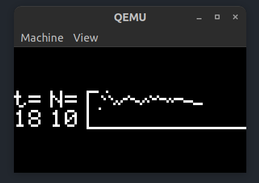

### 1. Sensor de Temperatura
Para gran parte del trabajo se utilizó como template el ejemplo de código para la placa mencionada. 
En el caso de la tarea del sensor se utilizó la estructura del antiguo `CheckTask` en la cual se hace uso de un delay, que en este caso corresponde a la frecuencia con la que se simula el sensado de temperatura.
Para hacerlo un poco más realista implementé una funcion que genera numeros pseudo-aleatorios.
La llamada función `customRand()` lo que hace es iterar sobre una semilla inicial, realizando desplazamientos de bits. Digo que es pseudo-aleatoria porque los numeros que genera son aparentemente aleatorios pero la secuencia de numeros que se obtienen es siempre la misma. 

Los valores de temperatura obtenidos son de 20 grados +-5.

El valor pseudo-aleatorio es nuestra temperatura "sensada".
Este valor se envía a una cola que comunica a la tarea del sensor de temperatura con el del filtro.

### 2. Filtro
Este filtro consiste en un filtro circular, de tamaño `MAX_N` (15), el cual descarta el valor más antiguo una vez que se llena el arreglo. Utiliza el valor `N` para calcular el promedio entre las últimas `N` muestras. Este valor es variable y se puede incrementar y decrementar introduciendo caracteres via UART. 

Para el buffer circular tomé la consideración del caso en el cual el buffer aún no estuviera lleno, y el N fuera mayor que las muestras tomadas. En ese caso se toma el promedio de todas las muestras hasta el momento.

```c
if (dataCounter < MAX_N)
    {
        sampledData[dataCounter] = sampleValue;
        dataCounter++;
        startIndex = dataCounter - N;
        startIndex = startIndex <= 0 ? 0 : startIndex; 
        for (i = startIndex; i < dataCounter; i++)
        {
            accum += sampledData[i];
        }
    }
```

El objetivo de la variable `startIndex` es definir el comienzo de la iteración para calcular el promedio. 

Una vez que se calcula el promedio se envía a la `PrintQueue` que lo que hace es comunicar a la tarea del filtro con la que imprime en el display.

### 3. Grafico en Display
La tarea `vPrintTask` es la encargada de graficar en el display los valores de la temperatura.
Para que sea mas demostrativo agregué tambien el display del último promedio de temperatura medido, y el valor actual de la ventana N.

El display es de 16x96, lo que significa que posee 2 bits de alto, en los cuales había que mapear el valor de promedio de temperatura medido. Para esto se usa la función `displayTemperatureGraph(int temp, uint8_t graph[2])` que funciona de la siguiente manera:
- Se toma el módulo de la temperatura por 8, ya que mi idea fue obtener la _posición_ del pixel dentro de un byte, y a esto se le resta 7 ya que los píxeles estan ordenados de tal forma que el LSB del byte 0 (fila de arriba) corresponde al mayor valor de temperatura, y el MSB del byte 1 (fila de abajo) al menor valor de temperatura.
```
     | 0 | -> 23
 b   | 1 | -> 22
 y   | 2 | -> 21
 t   | 3 | -> 20
 e   | 4 | -> 19
     | 5 | -> 18
 0   | 6 | -> 17
     | 7 | -> 16

     | 0 | -> 15
 b   | 1 | -> 14
 y   | 2 | -> 13
 t   | 3 | -> 12
 e   | 4 | -> 11
     | 5 | -> 10
 1   | 6 | -> 9
     | 7 | -> eje x
```
- Una vez calculado el módulo, se hace una operación OR bitwise para poner en 1 el bit en la posición que corresponde.

Esto se hace para cada valor medido, y se grafica además el resto de los bits del eje x.

Una vez que se completa el gráfico, éste se borra y se arranca de nuevo.


### 4. Recepción de Caracteres via UART
Para esta tarea se hace uso de las interrupciones disponibles via UART. Se habilita el pin Rx, y cuando se genera una interrupción, el handler lo que hace es intentar tomar un semáforo que va a resguardar el recurso N, para que no sea leído por la tarea del filtro mientras éste se modifica.

Para la configuración de las interrupciones me basé en el ejemplo anterior, que habilitaba el modulo UART para el envío de caracteres, y utilizaba interrupciones a través de un puerto GPIO. 

### 5. Cálculo del Stack
El cálculo del stack se realizó utilizando la función `uxTaskGetStackHighWaterMark()` que nos retorna el valor (en palabras) mínimo de stack disponible de una tarea desde que la misma comenzó a ejecutarse con `vTaskStartScheduler()`.
Para esto se realizó la llamada en cada una de las tareas y se accedió a este valor a través de gdb. Después además se incluyó esta información en la tarea similar a TOP.

Para habilitar el uso de esta función se incluyó dentro del archivo de configuración la macro `#define INCLUDE_uxTaskGetStackHighWaterMark` seteada en 1.


### 6. TOP
Para obtener información del uso de recursos de cada tarea, se utilizó la función `uxTaskGetSystemState()` que devueve una estructura tipo `TaskStatus_t` que contiene información sobre el nombre de la tarea, prioridad, estado y cantidad de tiempo que consumió cada tarea.
Para habilitar esta función se setea a 1 la macro `#define configGENERATE_RUN_TIME_STATS` y también se configuran `#define portCONFIGURE_TIMER_FOR_RUN_TIME_STATS()` y `#define portGET_RUN_TIME_COUNTER_VALUE()` que son funciones que utiliza `uxTaskGetSystemState()` para calcular los valores en la estructura mencionada anteriormente.

Para dicha función hice uso del ejemplo provisto en la 
[documentación oficial](http://www.openrtos.net/uxTaskGetSystemState.html).

La información obtenida se ve así:

```bash
Task		Time		Percentage	    StackHighWatermark
****************************************************************** 
IDLE		39880		99%		        60 words
Sensor		20		    <1%		        30 words
UART		10		    <1%		        36 words
Print		120		    <1%		        18 words
Filter		30		    <1%		        28 words
```


